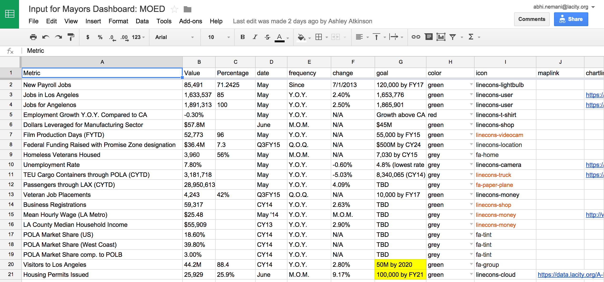

# bradley-tower

This is the live, operational dashboard for the mayor of Los Angeles, which any city is welcome to use and customize. It has been built to be decidely simple to deploy and maintain; it is free and open source, can be hosted freely on GitHub, and is powered by Google Docs (another free solution). 

There are two key functional elements to the dashboard: 

1. **"Metric Cards"**: Simple, quick-to-understand boxes for each key metrics (either overall or for a specific department/issue); these include a goal, a current status, a delta, and an editorial indication of progress (eg red, green). These are entirely built via the Google Sheets integration, and dynamically updated by any changes to those spreadsheets.
2. **Visualizations**: Interactive charts, graphs, an maps that provide deep dives into key policy/issue areas. These are typically manually built using D3 or CartoDB, though some charts are dynamically created by API integrations with Socrata; do note: most if not all are manually updated, in line with the city's performance management unit/process.

## Architecture / How Things Work

The core technology is TableTop.js, Bootstrap, Sheetsee.js, and Jekyll -- all client side software, which won't require a server or must work to get going. 

* **Jekyll**: Simple, lightweight content management system that makes it easy to create, say, a blog; for bradley tower, it is being used make it easy to add new pages and manage design across the board. Each dashboard is a "post" where the header content for Jekyll informs the system where the data is, etc.
* **Tabletop.js / Sheetsee.js**: Javascript plugins designed to easily pull data from Google Spreadsheets on the client side and build dynamic pages -- think using Google Sheets as a lightweight database that's easily editable by non-technical staff
* **Bootstrap**: Very popular design framework
* **D3** (by DevExpress): Custom varient of D3 with additional animations for visualizations

## Deploying the Dashboard

There are two versions of the Dashboard: this repository, which relies on Jekyll to manage pages / deployment; and another, lighterweight version that is all static HTML. (See here for documentation on deploying the latter, which is far easier and requires no local software -- eg git, etc.)

### Redeploying the site locally

```
[Fork this repository](https://github.com/datala/bradley-tower/fork)
Clone it: `git clone https://github.com/YOUR-USER/bradley-tower`
Install jekyll gem: gem install jekyll
Run the jekyll server: `jekyll serve`
```

### Deploying to Github

The site is hosted on GitHub using Github Pages and Jekyll. This means it comes at no cost and requires no internal hosting. Since it uses a few Jekyll plugins that Github doesn't support out of the box, you need to compile the static site locally and then push up final/live changes to a gh-pages branch on Github. This has been built into the system to make it fairly trivial by simply following up changes with a "rake" command:

```
- git add .
- git commit -m "MADE CHANGES"
- git commit origin master
- rake
```

### Setting up the Data

All of the data for the "metric cards" comes from a specific Google Sheet for each page on the dashboard:



It's important to keep the formatting/headers from the spreadsheet. You can grab a copy of the spreadsheet here and copy to your own Google Docs account. 

1. Go to the [Google Sheets template](https://drive.google.com/previewtemplate?id=1e2CJALC8PR7CrPeI0mjygmVjdPd905XLjwzaTuNRXK0&mode=public)
2. Select "Use this template" to save a working copy to your account
3. Select File - Publish to the Web, and copy the SheetID from the provided url (e.g. 1ZVxlgt9couygM7bzteI3YMX8OSE-jnfZAssTb8xUQ2Q)
4. Paste that url in the header section of any dashboard you hope to create with the label (gdoc) 

Note: the icon column relies on the popular, open, and free icons from Linecons and Font Awesome.

### Connecting the data to the dashboards

The basic content structure of the site is two fold: 

1. Top sheet: This features all the key visualizations in one page on the homepage; as mentioned above, these are fairly custom visualizations that are stored in /_includes/viz to ensure easy recall from page to page.
2. Dashboard pages: These pages rely on the Google Sheets integration and are stored in /_posts. To create a new page, simply duplicate an existing one and edit the file name, title, permalink, and **importantly the gdocs** field in the header. That will power the page.

Please reach out to @abhinemani if you're interested in helping out or redeploying it. 
